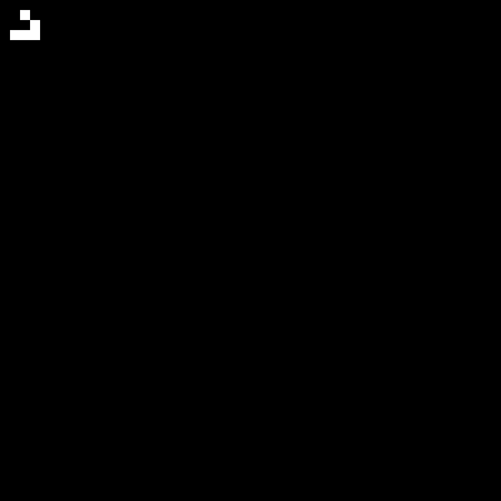

### Starting From the Start

I first learned about cellular automata as most people do, with John Conway's Game of Life. Since I am new to python I figured this would be as good a place as any to get started. It will let me get familiar with python syntax, array manipulation, and plotting/animation. It will also give me a chance to get better at adding code, figures, and videos to the blog.

John Conway's Game of Life is a simple simulation (single player "game") that takes place on a 2D grid world with discrete time. At any given time, each grid cell can either be alive or dead. Each cell follows rules that dictate whether they are alive or dead at the next time step. The rules are as follows

!Image From: https://playgameoflife.com/](./images/game_of_life_rules.jpg)

The way the "game" works is you pick some initial set of living cells and then hit run. Thats it. What is amazing is that from just these basic rules, we get a wide range of interesting "life like" behavior from the cells. I didn't really appreciate how cool this was when I first learned about it, but today I am very excited to see if I can recreate it. Lets begin!

### Code Overview

When I start a project I am used to thinking in MATLAB. So for these first few projects I will try to outline my plans in pseudocode first so that I can get used to thinking more abstractly. Hopefully this makes it easier when I go to implement it in python too. Also, if you notice that I like putting things into functions with big blocky comments, you would be correct.

```
# ----- Define World Parameters -----
world_size = NxM
world_wrap = true
time_steps = 1000
etc...

# ----- User Defined Initial World State -----
world_state = NxM matrix of 0s and 1s

$ ----- Simulate Game -----
FOR EACH time IN timesteps

    FOR EACH cell_index in world_state

        updated_world_state(cell_index) = update_cell(world_state,cell_index)

    END

    world_state = updated_world_state

END

```

### Initial Results

UPDATE: Had a very busy couple weeks at work with internal innovation activities. This drained all my creative energy so this project has been on pause. Below is a teaser of some initial results. I plan to get back on my post schedule starting after the July/4th weekend.

